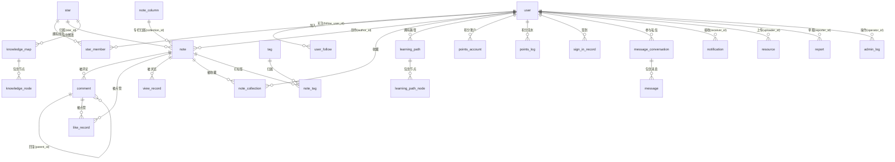

# 「编程知识星球」笔记资源分享平台 —— 项目说明书

> **用途**：毕业设计论文写作与答辩支撑材料
> **版本**：v1.0　**编写日期**：2026-09-21
> **代码基线**：后端 `user-center`（Spring Boot 3.2.12）· 前端 `demo1`（Vue 3.5 + Vite 7）
> **文档性质**：本文所有技术描述均以当前代码实现为准，标注 ⚠️ 处为「设计意图与实现现状存在差异」的诚实说明

---

## 目录

- [第 1 章 项目背景与目标](#第-1-章-项目背景与目标)
- [第 2 章 系统架构与功能模块](#第-2-章-系统架构与功能模块)
- [第 3 章 关键技术选型及理由](#第-3-章-关键技术选型及理由)
- [第 4 章 数据模型设计](#第-4-章-数据模型设计)
- [第 5 章 核心业务流程](#第-5-章-核心业务流程)
- [第 6 章 已实现与待完善部分](#第-6-章-已实现与待完善部分)
- [第 7 章 可扩展方向](#第-7-章-可扩展方向)
- [第 8 章 创新点与设计思路总结](#第-8-章-创新点与设计思路总结)
- [附录](#附录)

---

## 第 1 章 项目背景与目标

### 1.1 研究背景与问题提出

开发者在日常学习与工作中，知识往往散落在笔记软件、浏览器书签、聊天记录、云盘等多个彼此隔离的工具中，形成三类典型痛点：

| 痛点 | 具体表现 | 现有工具的不足 |
|------|----------|----------------|
| **沉淀难** | 知识以碎片形式产生，缺乏结构化归档 | 通用笔记软件只有「个人视角」，无社区协作与内容沉淀机制 |
| **检索难** | 时间久了找不到，全文检索能力弱 | 多数工具仅支持标题/标签的简单匹配，中文分词与相关性排序缺失 |
| **组织难** | 缺乏知识之间的关联表达 | 缺少知识图谱、学习路径等「结构化组织」载体 |

现有产品的定位也存在空档：内容社区类产品（如贴吧、论坛）偏重社交与灌水，知识沉淀属性弱；笔记工具类产品偏重个人使用，缺乏社区互动与知识共建。

### 1.2 项目定位与目标

本项目定位于**「以知识星球为组织单元的程序员知识社区」**：既保留个人笔记的结构化沉淀能力，又通过「星球（圈子）」把内容与人群组织起来，并叠加 AI 助手降低知识获取门槛。

**总体目标**：构建一个前后端分离、具备完整内容生产—消费闭环、并在性能与安全上经得起推敲的知识社区系统。

**分层目标**：

| 层次 | 目标 | 衡量方式 |
|------|------|----------|
| 功能层 | 覆盖「用户—内容—互动—组织—成长—治理」完整闭环 | 8 个功能模块、142 个前端接口全部可用 |
| 性能层 | 热点读走高并发路径，计数类写操作不直压数据库 | 多级缓存、布隆过滤器、Redis 原子计数 + 定时刷盘 |
| 安全层 | 覆盖认证、越权、注入、XSS、暴力破解、敏感信息泄露 | JWT + 拦截器注解、Jsoup 白名单、Redis 滑动窗口限流、Jackson 脱敏 |
| 工程层 | 结构分层清晰、约定统一、可维护可扩展 | 202 个后端源文件、22 组 Service 接口与实现分离、统一响应契约 |

### 1.3 与同类方案的差异（创新点概述）

1. **内容与人群的双重组织**：以「星球」作为内容归属单元与人群单元，同一条笔记既可被公开检索，也可归属到某个星球形成专栏序列（`note_column`）。
2. **性能优化的链路化落地**：不是零散地加缓存，而是按「读热点 / 写热点 / 存在性判断」三类分别给出多级缓存、Redis 批量刷盘、布隆过滤器三套方案，并配有缓存驱逐注解。
3. **事件驱动解耦**：把「笔记热度更新、积分发放、通知推送」等副作用从主流程剥离，用 Spring Event 解决 `@Async` 自调用失效问题，同时保证主流程响应时间。
4. **AI 能力的工程化集成**：基于 Spring AI 的 `ChatClient` 抽象接入 OpenAI 兼容接口，支持普通响应与 **SSE 流式响应**双通道，会话上下文持久化与 Redis 会话缓存分离。

### 1.4 术语约定

| 术语 | 含义 |
|------|------|
| **星球（Star）** | 平台中的圈子/社区单元，是内容组织与人群组织的载体 |
| **笔记/内容（Note）** | 平台的核心内容实体，支持 Markdown，可归属星球与专栏 |
| **专栏（Column）** | 星球内的系列笔记合集，作者把多篇笔记串联成有顺序的专栏 |
| **星球成员（StarMember）** | 用户与星球的多对多关系，含 owner/admin/member 三种角色 |
| **租户（Tenant）** | 多租户设计的隔离单元，本项目以星球为租户单位，隔离列 `star_id` |
| **逻辑删除** | 通过 `is_delete` 字段标记删除而非物理删除，由 MyBatis-Plus 自动过滤 |
| **热榜分（hotScore）** | 综合浏览量、点赞数、评论数计算的排序分值 |

---

## 第 2 章 系统架构与功能模块

### 2.1 总体架构

系统采用**前后端分离**架构，前端为单页应用（SPA），后端提供无状态 REST 接口 + WebSocket 长连接。

```
┌─────────────────────────────────────────────────────────────────┐
│                        浏览器（用户端 / 管理端）                   │
│   Vue 3 SPA ── Pinia 状态 ── Vue Router ── Axios 拦截器           │
│   ├─ 用户端 UserLayout（浏览免登录、操作需登录）                    │
│   └─ 管理端 BasicLayout（需管理员角色）                            │
└───────────┬──────────────────────────────────────┬──────────────┘
            │ HTTP /api/*（Vite 代理 5173 → 8080）  │ WebSocket /ws（STOMP over SockJS）
            ▼                                      ▼
┌─────────────────────────────────────────────────────────────────┐
│                    Spring Boot 应用（:8080，context-path=/api）   │
│                                                                  │
│  Filter 层     XssFilter（请求体转义）                            │
│      ↓                                                           │
│  Interceptor   AuthInterceptor（JWT 鉴权 / 注解权限）             │
│  责任链         RateLimitInterceptor（Redis 滑动窗口限流）          │
│      ↓                                                           │
│  Controller    29 个 REST 控制器（统一返回 BaseResponse<T>）       │
│      ↓                                                           │
│  Service       22 组「接口 + 实现」，业务逻辑与副作用编排           │
│      ↓                                                           │
│  Mapper        MyBatis-Plus（28 个 Mapper，XML 用于复杂查询）      │
│                                                                  │
│  横切能力：                                                        │
│   ├ 多级缓存  Caffeine L1 → Redis L2 → MySQL                      │
│   ├ 分布式锁  Redisson RLock + @PreventDuplicate AOP              │
│   ├ 布隆过滤器 Redisson RBloomFilter（防缓存穿透）                  │
│   ├ 事件驱动  Spring Event（热度分/积分/通知异步化）                 │
│   ├ 定时任务  @Scheduled（浏览量刷盘、会话清理、定时发布）            │
│   ├ 实时推送  STOMP 消息代理                                       │
│   └ AI 能力   Spring AI ChatClient（含 SSE 流式）                  │
└──────┬────────────────┬──────────────┬──────────────┬────────────┘
       ▼                ▼              ▼              ▼
   ┌────────┐     ┌──────────┐   ┌──────────┐   ┌──────────┐
   │ MySQL  │     │  Redis   │   │   ES     │   │ 阿里云OSS │
   │  yiya  │     │ 缓存/计数 │   │ 全文检索  │   │ 文件存储  │
   │ 26 张表 │     │ 锁/黑名单 │   │ IK 分词  │   │          │
   └────────┘     └──────────┘   └──────────┘   └──────────┘
```

**分层职责**：

| 层 | 包路径（后端） | 职责 | 约束 |
|---|---|---|---|
| 控制层 | `controller/` | 参数校验、调用 Service、组装统一响应 | 一律返回 `BaseResponse<T>`，不写业务逻辑 |
| 业务层 | `service/` + `service/impl/` | 业务规则、事务边界、缓存注解、事件发布 | 接口与实现分离，控制器只依赖接口 |
| 数据层 | `mapper/` | 单表 CRUD 由 MyBatis-Plus 提供，复杂查询走 XML | 禁用字符串拼接 SQL，统一 `#{}` 预编译 |
| 模型层 | `model/domain`、`model/dto`、`model/domain/request` | 实体、请求 DTO、传输对象分离 | 实体不直接作为请求体接收（除少数例外） |
| 横切层 | `interceptor/`、`filter/`、`annotation/`、`serializer/`、`event/`、`task/` | 鉴权、限流、脱敏、事件、定时任务 | 通过注解声明式接入 |

### 2.2 功能模块划分

系统共划分 **8 个业务模块**，对应前端 `views/` 下的 13 个页面分组（共 43 个页面）：

| 模块 | 核心能力 | 后端控制器 | 前端页面分组 |
|------|----------|-----------|--------------|
| **1. 用户与认证** | 注册/登录/登出、JWT、图形验证码、OAuth（GitHub/QQ）、密码修改与重置、注销、封禁 | `UserController`、`OAuthController`、`CaptchaController` | `User/`(8)、`Home/`(2) |
| **2. 内容创作与消费** | Markdown 发布（Vditor）、内联编辑、草稿/发布/拒绝状态机、置顶、封面、标签、专栏 | `NoteController`、`ContentController`、`ColumnController` | `Notes/`(3)、`Content/`(2) |
| **3. 资源分享** | 文件上传（OSS）、资源分类、下载计数、上下架、审核 | `ResourceController`、`UploadController` | `Resources/`(5) |
| **4. 社区互动** | 嵌套评论、评论审核、点赞、收藏、关注/粉丝、私信、@提及、举报 | `CommentController`、`FollowController`、`CollectionController`、`MessageController`、`ReportController` | `Comments/`(1)、`User/` |
| **5. 知识组织** | 知识图谱（SVG 拖拽编辑）、知识节点、学习路径与进度 | `KnowledgeController`、`LearningPathController` | `Knowledge/`(2) |
| **6. 知识星球** | 星球创建/加入/退出、成员与角色管理、星球公告、星球内容流、付费星球内容脱敏 | `StarController` | `Stars/`(5) |
| **7. 检索与发现** | ES 全文检索（IK 分词）、多类型搜索（笔记/用户/资源）、热搜词云、热榜、推荐 | `SearchController`、`RecommendController` | `Search/`(1)、`Tags/`(2) |
| **8. 成长与治理** | 积分与签到、成长轨迹、贡献热力图、数据看板；管理员对内容/评论/用户/敏感词的管理与日志 | `PointsController`、`StatsController`、`AdminController`、`SensitiveWordAdminController` | `Growth/`(1)、`Stats/`(1)、`Admin/`(3) |
| **9. AI 助手** | AI 聊天（普通 + 流式）、会话管理、消息已读 | `ChatController` | `components/AIFloatBall`、`AIFloatWindow` |

### 2.3 代码组织结构与规模

**后端（`user-center/`，202 个 Java 源文件）**

```
com.example.usercenter
├── annotation/     自定义注解：@LoginRequired @AdminRequired @RateLimit @MaskSensitive @PreventDuplicate
├── common/         统一契约：BaseResponse、ErrorCode、ResultUtils、PageResult
├── config/         13 个配置类（见 2.4）
├── controller/     29 个 REST 控制器
├── event/          Spring 事件：NoteHotScoreEvent + NoteEventListener
├── exception/      BusinessException + GlobalExceptionHandler
├── filter/         XssFilter + XssHttpServletRequestWrapper
├── interceptor/    AuthInterceptor、RateLimitInterceptor、TenantInterceptor、
│                   PreventDuplicateAspect、WebSocketAuthChannelInterceptor
├── mapper/         28 个 MyBatis-Plus Mapper
├── model/          domain(30) / domain.request / dto / enums / es
├── serializer/     MaskSensitiveSerializer、TagsDeserializer
├── service/        22 个接口 + 22 个实现
├── task/           FlushViewCountTask、CleanInactiveSessionTask、ScheduledPublishTask、
│                   SearchHotDecayTask、WarmUpRunner
└── utils/          JwtUtils、UserContext、DistributedLockUtils、SensitiveWordChecker、
                    AliyunOSSOperator、RedisChatOperator、XssUtils
```

**前端（`demo1/`，62 个 Vue 文件 + 19 个 JS 模块）**

```
demo1/src
├── views/       43 个页面（Admin/Comments/Content/Growth/Home/Knowledge/Notes/
│                Resources/Search/Stars/Stats/Tags/User）
├── components/  16 个通用组件（VditorEditor、AIFloatBall、AIFloatWindow、ChatWindow、
│                LikeButton、FollowButton、GlobalSearch、NotificationBell、
│                ContributionHeatmap、StatsCard、UserAvatar、PathNode、Fireworks…）
├── layouts/     BasicLayout（管理端）/ UserLayout（用户端）
├── router/      router.js（含 requiresAuth / requiresAdmin 元信息与全局守卫）
├── store/       Pinia：userLogin.js / app.js / notification.js
└── utils/       request.js（Axios 封装，注入 Token 与 X-Star-Id）、api.js（142 个接口函数）、
                 starScope.js（星球作用域读写）、apiContract.js、oauth.js、stream.js、
                 chatMessageProcessor.js、markdown.js、errorTracker.js、
                 performance.js、exportUtils.js…
```

### 2.4 配置类清单（13 个）

| 配置类 | 职责 |
|--------|------|
| `JacksonConfig` | JSON 序列化全局配置（日期格式、忽略未知属性） |
| `CacheConfig` | 多级缓存：Caffeine L1 + Redis L2 + `CompositeCacheManager` |
| `BloomFilterConfig` | Redisson `RBloomFilter`，启动加载已发布笔记 ID |
| `MybatisPlusConfig` | 分页插件 + 多租户插件 `TenantLineInnerInterceptor` |
| `DruidConfig` | Druid 连接池 + SQL 防火墙 + 监控（慢 SQL 阈值 2000ms） |
| `RedisConfig` | `RedisTemplate` 序列化配置 |
| `RedissonConfig` | Redisson 客户端（分布式锁） |
| `SecurityConfig` | 关闭 CSRF、会话设为 STATELESS、CORS 配置 |
| `WebMvcConfig` | 拦截器注册（Auth + RateLimit） |
| `WebSocketConfig` | STOMP 消息代理 + SockJS 端点 |
| `AsyncConfig` | `@EnableAsync` + `@EnableScheduling`，线程池 core=5 / max=20 / queue=100 |
| `ElasticsearchConfig` | ES 8.x Java Client |
| `SwaggerConfig`、`CommonConfiguration` | SpringDoc OpenAPI 文档；Spring AI `ChatClient` |

### 2.5 部署与运行形态

| 组件 | 端口 | 说明 |
|------|------|------|
| 前端 Vite Dev Server | **5173（已固定，`strictPort: true`）** | 代理 `/api` → `localhost:8080` |
| 后端 Spring Boot | 8080（context-path `/api`） | `spring-boot:run` 或 `java -jar` |
| MySQL | **3307** | 库名 `yiya`；**必须 8.0+**——Flyway 9.x 社区版不支持 MySQL 5.7，版本过低会导致应用启动失败 |
| Redis | 6379 | 缓存、锁、黑名单、计数、会话 |
| Elasticsearch | 9200 | 全文检索（可选依赖，缺失时降级为数据库查询） |

**启动顺序**：MySQL → Redis →（可选）Elasticsearch → 后端 → 前端。

---

## 第 3 章 关键技术选型及理由

### 3.1 后端框架与持久层

| 选型 | 版本 | 理由 |
|------|------|------|
| **Spring Boot** | 3.2.12 | 生态成熟、自动装配降低配置成本；3.x 基于 Jakarta EE 9+，原生支持 Java 17 与虚拟线程演进路线 |
| **Java** | 17（LTS） | 与 Spring Boot 3.x 的基线一致；记录类、sealed 类、增强 switch 等特性提升可读性 |
| **MyBatis-Plus** | 3.5.14 | 相比 JPA，手写 SQL 可控性更强，符合国内团队习惯；同时提供分页插件、逻辑删除、多租户插件、乐观锁等开箱能力，本项目的 `is_delete` 自动过滤与 `TenantLineInnerInterceptor` 均直接受益 |
| **Druid** | — | 连接池自带 SQL 监控与防火墙，慢 SQL 阈值可配置，便于性能问题定位 |
| **Jackson** | 2.x | 替换 FastJSON（历史安全漏洞多），并借助 `@JsonSerialize` 实现数据脱敏 |

**取舍说明**：项目中只有 `NoteMapper.xml` 一个 XML 映射文件，复杂查询（含动态条件、批量更新）走 XML，其余单表操作全部由 MyBatis-Plus 的 `BaseMapper` 提供，避免 XML 与注解混用带来的维护成本。

### 3.2 缓存与性能设计

| 技术 | 用途 | 选型理由 |
|------|------|----------|
| **Caffeine（L1）** | JVM 进程内缓存 | 微秒级访问，无需网络往返；`maximumSize=5000`、`expireAfterWrite=5min`、`expireAfterAccess=2min` 防止内存膨胀 |
| **Redis（L2）** | 分布式缓存 | 多实例共享，解决 L1 数据不一致；按缓存名分设 TTL：`noteList` 5min、`noteDetail` 10min、`hotRank` 2min、`userInfo` 30min、`starList` 15min |
| **`CompositeCacheManager`** | 组合两级缓存 | Spring Cache 抽象下按声明顺序查找，业务代码只需 `@Cacheable`/`@CacheEvict`，不感知层级 |
| **Redisson `RBloomFilter`** | 防缓存穿透 | 对「笔记 ID 是否存在」做前置判断，避免无效查询打穿到数据库；启动时批量加载已发布笔记 ID |
| **Redis 原子计数 + 定时刷盘** | 浏览量统计 | 将高频 `UPDATE` 转成内存 `INCR`，再由 `@Scheduled(fixedDelay=60000)` 批量落库，把 N 次写压缩为 1 次 |

**为什么不用「直接更新数据库」**：以 1000 人同看一篇笔记为例，直连数据库是 1000 次写操作；Redis 方案是 1000 次内存自增 + 每 60 秒一次批量 `UPDATE ... SET view_count = view_count + delta`。

### 3.3 并发控制

| 技术 | 应用 | 理由 |
|------|------|------|
| **Redisson 分布式锁 + `@PreventDuplicate` AOP** | 16 处写接口（点赞、关注、收藏、评论、发私信、创建星球等） | 声明式接入，业务代码零侵入；`waitTime=0` 表示拿不到锁立即失败，符合「防重复提交」而非「排队执行」的语义 |
| **数据库唯一索引兜底** | `like_record(user_id, target_type, target_id)` | 分布式锁失效时仍有最终一致性保障；点赞采用「直接 INSERT + 捕获唯一键冲突」，消除「先查后插」的 TOCTOU 竞态窗口 |
| **Redis Set + 唯一约束（历史方案）** | — | ⚠️ 文档中曾描述「Redis Set 判重」，实际实现为纯唯一索引方案（见 5.6） |

### 3.4 鉴权与安全

| 技术 | 用途 | 理由 |
|------|------|------|
| **JWT（JJWT 0.12.x，HS256）** | 无状态认证 | 前后端分离场景下不依赖 Cookie/Session，天然免疫 CSRF；claims 携带 `userId`、`userRole`、`starId` |
| **`@LoginRequired` / `@AdminRequired` + `AuthInterceptor`** | 注解式权限控制 | 权限逻辑集中在一处，避免各 Controller 重复写 `isAdmin()` 判断而漏鉴权 |
| **Redis 黑名单** | Token 主动失效 | JWT 无状态导致登出后仍有效，登出/销户时写入 `blacklist:{token}`（TTL = Token 剩余有效期），`AuthInterceptor` 与 `WebSocketAuthChannelInterceptor` 双重校验 |
| **Redis 滑动窗口限流（`@RateLimit`）** | 接口级防刷 | 登录接口 60 秒 10 次，AI 流式接口 60 秒 20 次；参数为 `key`/`windowSeconds`/`maxRequests` |
| **Jsoup 白名单 + `XssFilter`** | XSS 防护 | 服务端全局 `HttpServletRequestWrapper` 转义请求参数；笔记内容因需渲染 Markdown HTML，采用白名单过滤而非全量转义；前端另用 DOMPurify 做二次防线 |
| **`@MaskSensitive` + `MaskSensitiveSerializer`** | 数据脱敏 | 手机号输出 `138****5678`、邮箱 `z***@qq.com`；基于 Jackson 序列化期处理，与业务代码解耦 |
| **BCrypt** | 密码存储 | 自带盐值、可调计算强度，抵御彩虹表；兼容历史 MD5 数据并在首次登录时自动升级 |
| **文件上传校验** | 上传安全 | 扩展名白名单 + 大小限制 + 文件名清洗，防止任意文件上传 |

### 3.5 全文检索

| 技术 | 版本 | 理由 |
|------|------|------|
| **Elasticsearch** | 8.15（Java Client） | 中文全文检索需要分词与相关性打分，MySQL `LIKE` 无法满足；ES 的 `ik_max_word`（建索引）/ `ik_smart`（查询）组合兼顾召回率与精度 |
| **`search:hot` Redis ZSET** | — | 热搜词云用 `ZINCRBY` 累加词频、`ZREVRANGE` 取 Top10，避免为统计功能引入额外组件 |

**降级设计**：ES 不参与主链路事务，作为可选组件；未部署时搜索接口退化为数据库查询，系统仍可运行。

### 3.6 实时通信

| 技术 | 用途 | 理由 |
|------|------|------|
| **WebSocket + STOMP + SockJS** | 站内通知实时推送 | STOMP 提供消息语义（订阅/目的地），SockJS 在不支持 WebSocket 的环境自动降级；相比轮询显著降低请求量与延迟 |
| 端点与目的地约定 | `/ws`（SockJS）；消息代理 `/topic`；应用前缀 `/app`；用户前缀 `/user`；点对点推送 `/user/{userId}/queue/notification` | 通过 `convertAndSendToUser` 实现私有队列推送 |
| **`WebSocketAuthChannelInterceptor`** | 连接鉴权 | 在 STOMP 通道层校验 JWT 与黑名单，防止未认证连接 |

### 3.7 AI 能力集成

| 技术 | 版本 | 理由 |
|------|------|------|
| **Spring AI** | 1.0.0-M4 | 提供 `ChatClient` 统一抽象，屏蔽不同大模型厂商差异；接入 OpenAI 兼容接口（如 DashScope），更换模型仅需改配置 |
| **双通道响应** | — | `POST /chat/message` 返回完整结果；`POST /chat/message/stream` 返回 `Flux<ServerSentEvent<String>>`，用 SSE 实现打字机效果，改善长回答的等待体验 |
| **会话隔离** | — | 会话元信息持久化到 `message_conversation`，上下文缓存于 Redis（`chat:session:*`），支持会话列表、改名、删除、消息已读 |

### 3.8 其他中间件

| 技术 | 用途 | 理由 |
|------|------|------|
| **阿里云 OSS（SDK 3.17）** | 文件与图片存储 | 避免文件落本地磁盘（多实例部署下不可共享），同时减轻应用服务器带宽压力；`AliyunOSSOperator` 封装上传/删除，配置外置到 `application-*.yml` |
| **Hutool** | 工具集 | 图形验证码生成、HTTP 客户端（OAuth 换取 token）等，减少样板代码 |
| **SpringDoc（OpenAPI 2.5）** | 接口文档 | 与代码同步，`/api/swagger-ui.html` 可直接调试 |
| **Redisson** | 分布式锁 / 布隆过滤器 | 相比手写 `SETNX`，提供锁续期、可重入、以及现成的布隆过滤器实现 |
| **Flyway（`flyway-core` + `flyway-mysql`）** | 数据库版本化管理 | DDL 变更以「有序、不可变、可重复执行」的迁移脚本表达，随应用启动自动执行；相比手工执行 SQL，杜绝了环境之间的结构漂移，也让「新同事搭环境」变成一条命令。开启 `baseline-on-migrate`，已有库标记为基线后只跑增量，可平滑接入存量项目 |
| **`error_log` 自建错误落库** | 前端错误闭环 | 前端 `errorTracker.js` 采集 JS 错误/Promise 异常/组件错误，通过 `sendBeacon` 上报后端落库，配合管理员查询接口形成「采集 → 上报 → 存储 → 排查」闭环；相比接入第三方监控（Sentry 等），自建方案无外部依赖、与业务用户体系天然打通 |

### 3.9 前端技术栈

| 技术 | 版本 | 理由 |
|------|------|------|
| **Vue 3** | 3.5（`<script setup>`） | 组合式 API 便于按业务聚合逻辑，类型友好，社区生态完善 |
| **Vite** | 7.x | 基于 ESM 的按需编译，冷启动与热更新显著快于 Webpack；配置简洁（`vite.config.js` 仅需代理与端口） |
| **Ant Design Vue** | 4.2 | 企业级组件库，表格/表单/上传等复杂组件开箱即用，降低 UI 开发成本 |
| **Pinia** | 3.0 + `persistedstate` | 官方推荐状态管理；持久化插件自动把登录态写入 `localStorage`，无需手写存取逻辑 |
| **Vue Router** | 4.x | 通过路由 `meta.requiresAuth / requiresAdmin` + 全局前置守卫实现前端权限控制 |
| **Vditor** | 3.11 | 专业 Markdown 编辑器，支持分屏预览、即时渲染、代码高亮、数学公式、图片上传与本地缓存 |
| **marked + highlight.js + turndown + DOMPurify** | — | 渲染链路：marked 解析 Markdown → highlight.js 代码高亮 → DOMPurify 净化 HTML；turndown 用于「内联编辑后回写 Markdown」 |
| **Axios** | 1.12 | 请求/响应拦截器统一注入 Token 与处理业务异常 |
| **SockJS Client + @stomp/stompjs** | — | 与后端 STOMP 协议对接 |

### 3.10 选型决策小结

| 决策点 | 备选方案 | 本项目选择 | 关键理由 |
|--------|----------|-----------|----------|
| 认证方式 | Session / JWT | **JWT** | 前后端分离 + 多端复用，无状态易横向扩展 |
| ORM | JPA / MyBatis-Plus | **MyBatis-Plus** | SQL 可控 + 插件生态（分页/逻辑删除/多租户） |
| 缓存层级 | 单级 Redis / 多级 | **Caffeine + Redis 多级** | 兼顾微秒级热点读与多实例一致性 |
| 全文检索 | MySQL LIKE / ES | **ES + IK** | 中文分词与相关性排序刚需 |
| 实时推送 | 轮询 / SSE / WebSocket | **WebSocket(STOMP)** | 双向、低延迟，且可复用同一鉴权体系 |
| 防重复提交 | 前端置灰 / 分布式锁 | **分布式锁 + 唯一索引** | 前端限制可绕过，服务端才可靠 |
| 浏览量统计 | 每次 UPDATE / Redis 刷盘 | **Redis 原子计数 + 定时刷盘** | 写压力降低数个数量级 |

---

## 第 4 章 数据模型设计

### 4.1 设计原则与命名约定

1. **字符集统一** `utf8mb4` / `utf8mb4_unicode_ci`，兼顾中文与 emoji。
2. **命名规范**：表名与列名一律 `snake_case`；Java 字段 `camelCase`，由 MyBatis-Plus 自动映射。
3. **主键策略**：`BIGINT AUTO_INCREMENT` 自增（`id-type: AUTO`）。
4. **逻辑删除**：统一字段 `is_delete`（0=未删除，1=已删除），由 `@TableLogic` 自动追加条件。
5. **审计字段**：`create_time` / `update_time` 由数据库默认值与 `ON UPDATE` 自动维护。
6. **冗余字段**：对高频联表查询的展示字段做冗余（如 `comment.username`、`note.author`），以空间换查询效率。
7. **租户列** `star_id` 出现在 5 张表：`note`、`star_member`、`note_column`、`comment`、`knowledge_map`；
   另有 `user.current_star_id` 记录「用户当前所在星球」，作为多租户上下文（详见 5.9）。
8. **唯一约束优先**：能靠唯一索引保证的业务约束（点赞、收藏、关注、签到）不依赖应用层判断。

> **权威脚本（双轨）**：
> - **机械权威**（版本化管理）：`user-center/src/main/resources/db/migration/`
>   —— `V1__baseline_schema.sql`（基线 25 张表）、`V2__multi_tenant_scope_and_error_log.sql`（多租户作用域 + 错误日志），由 Flyway 自动执行；
> - **人类可读全量快照**： [`db/schema.sql`](../../db/schema.sql)（26 张表 + 索引 + 初始化数据 + 增量升级附录），供查阅与手工建库。
>
> 两者等价（快照 = 全部迁移的顺序累加），新增迁移时需同步更新快照。
>
> ✅ **该链路已实跑验证**（2026-09-21）：在存量库（25 张表）上启动应用，Flyway 自动基线到 `v1`、执行 `V2`、到达 `v2`，应用正常启动。
>
> ⚠️ **运行前置条件**：MySQL 需 **8.0+**（Flyway 9.x 社区版不支持 5.7）。
> ⚠️ **新增迁移脚本时**：`pom.xml` 的 `<resources><includes>` 是扩展名白名单，务必确认 `**/*.sql` 在列，否则脚本不会被打进 classpath。
>
> ⚠️ **若已用快照手工建过库**（快照已含 `V2` 的改动），再启动应用前须把 `spring.flyway.baseline-version` 改为 `2`，否则 Flyway 会重复执行 `V2` 并报「字段已存在」。

### 4.2 数据表清单（26 张，按业务域分组）

| 域 | 表 | 说明 |
|----|----|------|
| **用户与关系** | `user` | 用户主表（账号、密码、角色、状态、资料） |
| | `user_follow` | 关注关系（多对多） |
| **星球** | `star` | 星球（名称、公告、封面、价格、成员数、内容数） |
| | `star_member` | 星球成员（角色 owner/admin/member，唯一键 `star_id+user_id`） |
| **内容** | `note` | 笔记/内容（标题、Markdown 正文、状态、统计数、标签 JSON、星球与专栏归属、置顶） |
| | `note_column` | 专栏/合集（星球内系列笔记） |
| | `comment` | 评论（支持 `parent_id` 二级嵌套、审核状态、点赞数） |
| | `tag` | 标签（使用次数，唯一名） |
| | `note_tag` | 笔记-标签关联（唯一键 `note_id+tag_id`） |
| **资源** | `resource` | 资源（名称、类型、OSS 地址、大小、下载数、上下架状态、上传者） |
| **互动** | `like_record` | 点赞记录（唯一键 `user_id+target_type+target_id`，支持笔记与评论） |
| | `view_record` | 浏览记录（用户/匿名 IP、User-Agent） |
| | `note_collection` | 笔记收藏（唯一键 `user_id+note_id`） |
| | `report` | 举报记录（目标类型 note/comment/user，处理状态） |
| **通信** | `message_conversation` | 私信会话（唯一键 `user1_id+user2_id`，冗余最后一条消息） |
| | `message` | 私信消息 |
| | `notification` | 站内通知（类型、关联目标、已读状态） |
| **知识组织** | `knowledge_map` | 知识图谱（`config` JSON 存节点与连线） |
| | `knowledge_node` | 知识节点（坐标、归属图谱） |
| | `learning_path` | 学习路径 |
| | `learning_path_node` | 学习路径节点（状态 pending/in_progress/completed） |
| **成长激励** | `points_account` | 积分账户（余额、累计获得） |
| | `points_log` | 积分流水（类型 sign/publish/like/comment） |
| | `sign_in_record` | 签到记录（唯一键 `user_id+sign_date`，连续天数） |
| **治理** | `admin_log` | 管理员操作日志（操作人、目标、动作、备注） |
| | `error_log` | 前端错误上报落库（错误类型、消息、堆栈、页面 URL、UA、用户/IP、处理状态） |

### 4.3 实体关系总览



### 4.4 关键设计点

**① 内容表 `note` 的字段设计**

```sql
title, content_type, category, content(TEXT), summary,
author, author_id,                       -- author 为冗余展示字段
view_count, comment_count, like_count,   -- 计数冗余，避免实时聚合
status, publish_time, cover_image,
tags(JSON),                              -- 保留 JSON 数组，兼容历史查询
star_id, collection_id, collection_sort, -- 星球归属 + 专栏归属与章节序
is_top, is_delete, create_time, update_time
```

- **计数冗余**：`view_count` / `like_count` / `comment_count` 直接落列，列表页与热榜无需 `COUNT(*)`。
- **标签双写**：`tags` JSON 保留兼容旧查询，同时通过 `note_tag` 关联表支撑「标签广场聚合」与「按标签检索」。
- **状态机**：`draft → published / rejected`，配合 `publish_time` 与定时任务支持「定时发布」。

**② 唯一索引承担业务约束**

| 约束 | 实现 |
|------|------|
| 一人只能赞一次 | `like_record` 唯一键 `(user_id, target_type, target_id)` |
| 一人只能收藏一次 | `note_collection` 唯一键 `(user_id, note_id)` |
| 一人只能关注一次 | `user_follow` 唯一键 `(user_id, follow_user_id)` |
| 一天只能签一次 | `sign_in_record` 唯一键 `(user_id, sign_date)` |
| 一对一私信会话 | `message_conversation` 唯一键 `(user1_id, user2_id)` |
| 成员不重复 | `star_member` 唯一键 `(star_id, user_id)` |

**③ 索引策略**

- 列表类查询：`note(status, publish_time)` 复合索引 + `note(is_top)`
- 详情/归属类：`note(author_id)`、`comment(note_id, status)`、`view_record(user_id, note_id)`
- 检索类：`note(title, content)` 与 `resource(name)` 建 FULLTEXT 索引（ES 不可用时的降级路径）
- 所有 `star_id`、`user_id`、`create_time` 高频过滤列均建单列索引

**④ JSON 字段的取舍**

`note.tags`、`knowledge_map.config` 采用 JSON 类型：前者是为了兼容历史数据结构，后者是因为图谱的节点/连线结构随编辑器演进频繁变化，用 JSON 存储可避免频繁改表。

**⑤ 多租户列与内容隔离**

租户列是 `star_id`（**不是**通用文档里常写的 `tenant_id`），当前分布在 5 张表：`note`、`comment`、`star_member`、`note_column`、`knowledge_map`；另有 `user.current_star_id` 作为「用户当前所在星球」的上下文列。

隔离采用**三层机制**（详见 5.9）：显式 `star_id` 查询 → 成员/价格校验 → 请求级租户作用域注入。之所以不是「无条件全局注入」，是因为本平台是**公开知识社区**：
- `resource`、`learning_path`、`message` 等表**没有 `star_id` 列**，注入即报 `Unknown column 'star_id' in 'where clause'`；
- `note` 等表需要**跨星球公开读取**（首页、搜索、热榜），叠加 `star_id = 我所属的星球` 会让「查看别的星球」返回空结果。

```
读路径：  Caffeine L1  ──miss──▶  Redis L2  ──miss──▶  MySQL
          (微秒级)              (毫秒级)            (毫秒~秒级)
           ▲                                              │
           └────────────── 查询结果回填缓存 ◀───────────────┘

写路径：  INCR note:view:{id}  ──▶  每 60 秒批量读取  ──▶  UPDATE note SET view_count = view_count + delta
          (Redis 内存自增)          (FlushViewCountTask)      (一次写库替代 N 次写库)
```

---

## 第 5 章 核心业务流程

### 5.1 登录与鉴权

```
用户输入「账号」或「邮箱」+ 密码
   ↓
前端 Login.vue 两个页签（账号密码登录 / 邮箱登录）→ store.login() → POST /api/user/login
   ↓
UserController.userLogin
   ├ 参数校验（登录标识 ≥4 位、密码 ≥8 位）
   ├ @RateLimit(key="login", windowSeconds=60, maxRequests=10)  防暴力破解
   ↓
UserServiceImpl.userLogin
   ├ 按输入形态分流：含 @ 视为邮箱（校验邮箱格式）；否则视为账号（沿用「禁止特殊字符」规则）
   ├ 查库：WHERE (user_account = ? OR email = ?)，逻辑删除自动过滤
   ├ 用「密码匹配」从候选中确定用户（原因见下方说明）
   ├ 密码校验：BCrypt 优先；检测到历史 MD5 则校验通过后自动升级为 BCrypt
   ├ 账号状态校验（封禁则拒绝）
   ↓
签发 JWT
   ├ claims: userId / userRole / starId
   ├ starId 来源：StarMemberMapper.selectPrimaryStarId(userId) —— 取最早加入的星球
   ├ 有效期：记住我 = 30 天；否则取 spring.jwt.expiration（默认 86400 秒）
   ↓
前端 store.setUserInfo() → pinia persist 自动写入 localStorage
   ↓
后续所有请求由 Axios 拦截器注入 Authorization: Bearer <token>
   ↓
后端 AuthInterceptor.preHandle
   ├ 解析 Token → 校验签名与有效期
   ├ 查 Redis blacklist:{token} 判断是否已登出
   ├ 回填 UserContext（ThreadLocal：userId / userRole / starId）
   ├ 读取 @LoginRequired / @AdminRequired 注解决定是否放行
   ↓
afterCompletion → UserContext.clear()（防止线程复用导致串号）
```

> **登录标识：用户名或邮箱（2026-09-21 新增邮箱登录）**
>
> `POST /api/user/login` 的 `userAccount` 字段实为**登录标识**，既可传用户名也可传邮箱——
> 后端按「是否含 `@`」自动识别，无需新增接口或字段。
>
> ⚠️ **为什么用「密码匹配」而不是「唯一命中」**
>
> `user.email` **没有唯一索引**，库中存在多个账号共用同一邮箱的情况（例如自主注册的账号与
> GitHub 自动建号共用一个邮箱）。若沿用 `selectOne`，命中多条会抛 `TooManyResultsException`；
> 若只取「第一条命中」，则可能把用户登进别人的账号。
> 因此实现为：**取出全部候选 → 逐个校验密码 → 密码匹配者胜出**。
> 密码是唯一不可伪造的凭据，这样既不误登、也不报错；单账号场景与改造前完全等价。
> 服务端会记录 `登录标识 X 命中 N 个账号，已按密码匹配选中 id=Y`，便于后续清理重复邮箱。
>
> 实测（2026-09-21）：两个账号共用同一邮箱、密码不同时，各自用自己密码登录分别进入正确账号；
> 密码都不对时返回统一的「账号/邮箱或密码错误」，未泄露账号是否存在。

**登出与销户**：写入 `blacklist:{token}`，TTL 设为 Token 剩余有效期，实现「登出即失效」。

### 5.2 笔记发布与消费

```
发布：NotePublish.vue → Vditor 编辑（Markdown）→ POST /api/note/add
      → @PreventDuplicate(leaseTime=5) 防重复提交
      → 敏感词校验（DFA Trie）
      → XssFilter 净化内容
      → 落库（status=draft/published，published 时写 publish_time）
      → 发布 NoteHotScoreEvent（异步更新热度）
      → 同步到 Elasticsearch 索引

消费：GET /api/note/list（分页 + 分类 + 排序）
      → @Cacheable(noteList) 命中 Caffeine/Redis 直接返回
      → 未命中：布隆过滤器判断存在性 → 查询 MySQL → 回填缓存
      → 详情页 GET /api/note/{id} → 浏览量 +1 写入 Redis
```

### 5.3 浏览量统计（Redis 批量刷盘）

| 步骤 | 实现 |
|------|------|
| ① 累加 | 每次浏览 `INCR note:view:{noteId}`（纯内存操作） |
| ② 刷盘 | `FlushViewCountTask` 以 `@Scheduled(fixedDelay = 60000)` 每 60 秒扫描 `note:view:*` |
| ③ 落库 | 批量调用 `NoteMapper.incrementViewCountByDelta(id, delta)`，即 `UPDATE note SET view_count = view_count + delta` |
| ④ 清理 | 读取后删除计数键，避免重复累加 |

**收益**：把「每次访问一次写库」变成「每分钟一次批量写」，写入次数下降 2～3 个数量级。

### 5.4 热度排行榜

```
点赞 / 评论 / 浏览等行为
   ↓ publishEvent(NoteHotScoreEvent)
NoteEventListener（监听器）
   ↓ 计算 hotScore = viewCount + likeCount × 3 + commentCount × 2
HotRankService.updateHotScore(noteId, score)
   ↓ ZADD note:hot:{day|week}
Redis ZSET（按日榜 / 周榜分别维护）
   ↓ ZREVRANGE 取 Top N
GET /api/note/hot
```

**设计要点**：`@Async` 在同类内部自调用时不走代理因而失效，因此改用**事件驱动**——由 Spring 容器调用监听器，异步真正生效。这既解决技术债，也让「点赞」主流程不必等待排行计算。

### 5.5 全文检索与热搜词云

```
写入：笔记发布/更新 → EsSearchServiceImpl 同步文档到 notes 索引
      映射：title/summary/content 使用 ik_max_word 建索引、ik_smart 查询

查询：GET /api/search/notes?keyword=xxx
      → multiMatch(title^2, summary, content) 相关性排序
      → 命中高亮 → 返回
      → 同时 ZINCRBY search:hot keyword 1 累计词频

热词：GET /api/search/hot → ZREVRANGE search:hot 0 9
```

### 5.6 点赞与防重复（含实现订正）

```
Controller: POST /api/note/like/{id}
   @LoginRequired + @PreventDuplicate(waitTime=0, leaseTime=3)

Service: NoteServiceImpl.likeNote
   ① 校验登录状态与笔记存在性
   ② 直接 INSERT like_record（不先查后插，消除 TOCTOU 竞态窗口）
      └ 命中唯一键 uk_user_target → 捕获 DuplicateKeyException
        → 抛 BusinessException("已点赞，请勿重复操作")
   ③ INSERT 成功后 incrementLikeCount（原子自增）
   ④ 发布 NoteHotScoreEvent 异步更新热度
   ⑤ 给笔记作者 +2 积分
   ⑥ @Caching(evict) 同步失效 noteDetail 与 noteList 缓存
```

⚠️ **实现订正**：早期文档描述的「Redis Set 判重 + 数据库唯一索引双重保障」与代码不符，**实际只有唯一索引 + 接口级分布式锁**两道防线，没有使用 Redis Set。

### 5.7 站内通知（WebSocket 推送）

```
触发行为（被点赞/被评论/被 @提及/加入星球…）
   ↓
NotificationService 落库 notification
   ↓
WebSocketService.sendToUser(userId, payload)
   ↓ SimpMessagingTemplate.convertAndSendToUser(userId, "/queue/notification", payload)
   ↓ STOMP 消息代理（/topic 广播 + /user 私有队列）
前端 store/notification.js
   ├ 连接 /ws（SockJS + STOMP），连接时携带 JWT
   ├ 订阅 /user/queue/notification
   └ 收到消息 → 未读数 +1 → 弹窗提示
```

**连接鉴权**：`WebSocketAuthChannelInterceptor` 在 STOMP 通道层校验 JWT 与 Redis 黑名单，未认证连接被拦截。

### 5.8 AI 聊天（含流式响应）

```
普通模式：POST /api/chat/message
   ChatRequest{ sessionId?, content, sessionName?, streaming }
   → ChatService.sendMessage(request, userId)
   → 会话不存在则创建（message_conversation）
   → 读取 Redis 中的历史上下文
   → ChatClient 调用大模型 → 返回 ChatMessage（落库）

流式模式：POST /api/chat/message/stream
   @RateLimit(key="chat_stream", windowSeconds=60, maxRequests=20)
   → 返回 Flux<ServerSentEvent<String>>
   → 前端 stream.js 逐块解析 SSE → 打字机效果渲染
```

### 5.9 知识星球与内容隔离

```
创建星球 → 创建者自动成为 owner（star_member.role = owner）
加入星球 → @PreventDuplicate 防并发 → star_member 落库 → star.member_count +1
星球详情 → StarController.starDetail
   ├ 显式限定 eq("star_id", id) 查询该星球已发布笔记（置顶优先）
   ├ 判断当前用户是否已加入（star_member 查询）
   └ 付费星球且无权限 → canReadStarContent 判定后对正文脱敏（仅保留标题等）
星球内容流 → starFeed：in("star_id", 我已加入的星球集合)
```

**内容隔离的三层机制**

| 层 | 机制 | 承担的作用 |
|----|------|-----------|
| ① 显式查询 | `starDetail` / `starFeed` 主动追加 `eq("star_id", …)` | 星球页只展示本星球内容，语义清晰 |
| ② 权限校验 | `canReadStarContent`：非成员 / 未付费 → 正文脱敏（仅保留标题等） | 付费内容不外泄 |
| ③ **请求级租户作用域** | 前端路由守卫按页面写入星球作用域 → `request.js` 附加 `X-Star-Id` 请求头 → `AuthInterceptor` 校验成员身份后写入 `UserContext` → `TenantInterceptor` 对白名单表注入 `star_id = 作用域` | **纵深防御**：即便后端某处漏写 `eq("star_id")`，也不会读到其他星球的数据 |

**为什么是「作用域」而不是「全局注入」**

平台的公开属性决定了不能无条件注入：用户即使未加入某星球，也要能浏览其详情、参与搜索与热榜。因此改造为——**只有当前请求显式声明了星球上下文（`X-Star-Id` 且校验通过），且目标表在白名单内（`note` / `comment` / `note_column` / `knowledge_map`），才追加 `star_id` 条件**。这样隔离在星球作用域内是**强制**的，而首页 / 搜索 / 热榜等公开场景仍保持跨星球可读。

**为什么作用域由请求头而不是「用户的默认星球」**

`user` 表没有 `star_id`——用户与星球是多对多（`star_member`），不存在「用户唯一的星球」。若强行取「最早加入的星球」作为隐含作用域，用户在浏览 A 星球时插件会注入 B 星球的过滤条件，两个等值条件互斥 → 一条内容都查不到。请求头方案把「当前在看哪个星球」这一事实交由调用方显式声明，语义准确。

**`starId` 与 `starScope` 的区别**

| 概念 | 来源 | 用途 |
|------|------|------|
| `starId`（JWT claim） | 登录时由 `UserService.resolveCurrentStarId()` 解析（优先 `user.current_star_id`，为空则回退「最早加入的星球」） | 默认上下文、`starFeed` 等需要「我加入了哪些星球」的场景 |
| `starScope`（`UserContext`，请求级） | 请求头 `X-Star-Id`，经成员身份校验后写入 | 决定本次请求是否注入租户条件、注入哪个值 |

---

## 第 6 章 已实现与待完善部分

### 6.1 已实现功能清单

| 模块 | 已实现能力 |
|------|-----------|
| 用户与认证 | 注册、登录（**支持用户名或邮箱**，BCrypt + 历史 MD5 自动升级）、登出（Token 黑名单）、图形验证码（Hutool，4 位，5 分钟）、GitHub 第三方登录（QQ 相关代码与后端接口均保留，仅登录页入口暂时隐藏）、修改密码、重置密码、账号注销、封禁拦截 |
| 内容创作 | Vditor Markdown 编辑（分屏预览/代码高亮/公式/图片上传）、笔记详情内联编辑（contenteditable + turndown 回写）、分类与标签、封面、置顶、定时发布、状态流转 |
| 内容消费 | 笔记列表（分页/分类/排序）、详情、报名、热榜、推荐、全文搜索、热搜词云 |
| 资源分享 | OSS 上传、类型分类、下载计数、上下架、审核、我的资源 |
| 社区互动 | 二级嵌套评论、评论审核（pending/approved/rejected/hidden）、笔记与评论点赞、收藏（toggle + 我的收藏）、关注/粉丝、私信（会话+消息+未读数）、@提及、举报与处理 |
| 知识组织 | 知识图谱（SVG 拖拽编辑、笔记自动生成节点）、知识节点内容、学习路径与节点进度 |
| 知识星球 | 创建/加入/退出、成员与角色管理、星球公告、星球内容流、付费星球内容脱敏 |
| 成长与治理 | 签到与连续天数、积分账户与流水、成长轨迹、贡献热力图、数据看板、管理端（内容/评论/星球/用户/敏感词/举报/管理员日志） |
| AI 助手 | AI 聊天（普通 + SSE 流式）、会话增删改查、消息已读 |
| 平台能力 | 多级缓存、布隆过滤器、分布式锁、接口限流、XSS 过滤、数据脱敏、WebSocket 实时通知、统一响应契约、Swagger 文档 |
| 可观测与运维 | 前端错误采集并**落库**（`error_log` + 管理员查询页）、热搜词**定时衰减**、数据库**版本化迁移（Flyway）**、构建**零 IDE 依赖**（`./mvnw` 可独立运行） |

### 6.2 已具备的工程化能力

| 能力 | 具体实现 |
|------|----------|
| 统一响应契约 | `BaseResponse<T>{code, data, message, description}` + `ResultUtils`；前端 `request.js` 统一校验 `code` |
| 统一错误码 | `ErrorCode` 枚举（如 40100 未登录、40101 无权限、42900 操作过频）+ 前端 `apiContract.js` 镜像 |
| 全局异常处理 | `GlobalExceptionHandler` 捕获业务异常与系统异常，统一转成 `BaseResponse` |
| 声明式横切 | 5 个自定义注解：`@LoginRequired`、`@AdminRequired`、`@RateLimit`、`@MaskSensitive`、`@PreventDuplicate` |
| 前端可观测 | `errorTracker.js` 捕获 JS 错误/Promise 异常/组件错误并用 `sendBeacon` 批量上报；`performance.js` 采集 FCP/LCP/CLS/TTFB |
| 异步与定时 | 独立线程池（core=5/max=20/queue=100）+ 4 个定时任务（浏览量刷盘、会话清理、定时发布、启动预热） |
| 数据库版本化 | Flyway 管理 DDL：`V1__baseline_schema.sql` 为基线，`V2__…` 起为增量；开启 `baseline-on-migrate`，已有库标记为基线 1 后只执行后续脚本，杜绝「手工按序执行」导致的环境漂移 |
| 构建自举 | `./mvnw` 已修好 MSYS 路径兼容问题，仅需 JDK 17+ 即可完成构建，不依赖 IDE 内置 Maven；前端 `vite.config.js` 固定 5173 + `strictPort`，避免端口漂移导致 OAuth 回调失败 |
| 测试 | 4 个后端测试类（含笔记服务的缺陷条件测试与回归保护测试）+ 分布式锁验证脚本（`.sh` / `.ps1`） |

### 6.3 待完善部分与已知问题

> 本节如实记录当前实现与设计意图的差距。第三轮改造（2026-09-21）已修复其中 9 项，
> **保留原始问题描述与修复过程，用于说明「发现问题 → 定位根因 → 改造 → 验证」的完整工程闭环**。

#### 6.3.1 已修复（9 项）

| # | 原问题 | 根因 | 修复方案 | 验证 |
|---|--------|------|----------|:----:|
| 1 | **多租户过滤未真正启用** | `JwtUtils.generateToken()` 未写入 `starId` claim（读取端恒为 `null`）；且原 `IGNORE_TABLES` 覆盖全部业务表，插件完全惰性 | **作用域化改造**：①`user` 新增 `current_star_id`、`comment` 新增 `star_id`；②`UserContext` 新增请求级「星球作用域」；③`TenantInterceptor` 由「全局忽略表」改为「作用域 + 白名单」；④前端新增 `starScope.js`，路由守卫按页面写入作用域，`request.js` 自动附加 `X-Star-Id` 请求头；⑤补 `starId` claim 并新增 `resolveCurrentStarId()` | 后端 `202` 个源文件编译通过；前端 `3660` 模块构建通过 |
| 2 | **接口文档覆盖不全** | 文档生成于前端早期版本，仅覆盖 35 个接口，而实际调用 142 个 | 新增第十三章「完整接口清单」：脚本从 `api.js` 提取全部 **142** 个接口并归入 **23** 个模块；同时解析后端 178 条路由逐条比对，结果 **142/142 全部匹配** | 静态比对全绿 |
| 3 | **第三方登录依赖人工配置** | 回调地址需与开放平台登记完全一致；Vite 端口若被占用会静默递增，导致回调落到无人监听的端口 | ①`vite.config.js` 固定 `port: 5173` + `strictPort: true`；②生产 `redirect-uri` 由 `localhost:5173` 改为真实域名；③`redirect_uri` 补 `URLEncoder` 编码；④补 GitHub 的 `state` 随机串 + 回调校验（原 `generateState()` 是从未被调用的死代码）；⑤`OAuthController` 新增 `@PostConstruct` 启动校验——打印生效回调地址，prod 仍指向 localhost 时直接报错 | 编译通过 |
| 4 | **构建依赖 IDE** | `.mvn/wrapper/maven-wrapper.jar` 被忽略；根因是**发行版 `bin/mvn` 在 MSYS 下把 `MAVEN_HOME` 归一化成 `/c/...`，Windows 版 `java.exe` 无法识别** | 给 `mvnw` 打补丁：检测到 `cygpath` 时直接用 Windows 路径启动 classworlds launcher。*踩坑记录*：脚本第 32 行 `set -euf` 的 `-f` 会**关闭通配符展开**，故定位 jar 必须用 `find` 而非 `*.jar` glob | `./mvnw -v` 在 Unix 风格 / Windows 风格 / 未设置 `JAVA_HOME` 三种环境下均正常 |
| 5 | **数据库迁移手工执行** | 未启用 Flyway，DDL 需人工按序执行，易产生环境漂移 | 引入 `flyway-core` + `flyway-mysql`；建立基线 `V1__baseline_schema.sql`（25 张表）与 `V2__multi_tenant_scope_and_error_log.sql`；开启 `baseline-on-migrate`，已有库标记为基线 1 后只跑增量。**落地过程中另修掉一个隐藏缺陷**：`pom.xml` 的 `<resources><includes>` 是扩展名白名单，漏了 `**/*.sql`，导致迁移脚本从不进入 classpath（Flyway 报 `No migrations found`），已补上 | **已在本机实跑验证**：Flyway 自动基线到 `v1` → 执行 `V2` → `now at version v2`，应用 23 秒启动成功、接口返回 200 |
| 7 | **错误上报未闭环** | 前端已具备采集与上报能力，后端无落库链路 | 新增 `error_log` 表 + `ErrorLog` 实体 + `ErrorLogMapper`；重写 `ErrorReportController`（接收上报 + 管理员分页查询） | 编译通过 |
| 8 | **搜索热度无衰减** | `search:hot` ZSET 只增不减，长期运行偏离「当前热点」 | 新增 `SearchHotDecayTask`：每日 04:00 按 `0.9` 衰减因子重建 ZSET（读 → 临时 key 重建 → `RENAME` 原子替换），低于 `0.5` 的词淘汰 | 编译通过 |
| 9 | **OAuth 用户密码为空串** | 第三方登录创建的用户 `userPassword = ""` | 引入 `UserConstant.OAUTH_PASSWORD_PLACEHOLDER = "!oauth-no-password!"`；登录逻辑显式拒绝该占位符（不进入密码比对）；`V2` 迁移把存量空密码统一改写 | 编译通过 |
| 10 | **仓库存在构建/IDE 产物** | `.history/`、`target/`、`dist/` 占用体积 | 清理 `.history/`（3 处共 291 个编辑器历史文件）、`user-center/target/`（105 MB）、`demo1/dist/`（24 MB）；`node_modules/` 因影响日常开发**保留** | 清理完成 |
| 11 | **部署后登录/注册 403（`Invalid CORS request`）**<br>*部署阶段发现* | `SecurityConfig` 的 CORS 来源白名单被硬编码，只登记了 `https://www.e-ren.icu`，而线上实际走**顶级域** `https://e-ren.icu`。前端用相对路径 `/api`，页面与接口虽同源，但浏览器对 `POST + application/json` 这类**非简单请求**即使同源也会携带 `Origin` 头，Spring 据此校验白名单 → 未登记即 403。**「同源不需要 CORS」是错误直觉** | 白名单改为配置项 `center.cors.allowed-origins`（不再硬编码）；补 `https://e-ren.icu` 与 `http://127.0.0.1:5173`；`SecurityConfig` 启动时打印生效白名单；自动纠正末尾多余 `/` | 对照实测：修复前 `https://e-ren.icu` → 403、`www` → 200；修复后两者均 200，`https://evil.example.com` 仍 403 |

#### 6.3.2 仍未解决（1 项）

| # | 问题 | 现状与影响 | 后续建议 |
|---|------|-----------|----------|
| 6 | **测试覆盖不足** | 仅 4 个后端测试类，缺少 Service 层单测、Controller 集成测试、前端单测 | 补充关键链路的集成测试与前端 Vitest 用例 |

#### 6.3.3 改造过程中发现的边界与遗留

| 事项 | 说明 |
|------|------|
| 租户作用域依赖前端配合 | 隔离生效的前提是前端在星球页面带上 `X-Star-Id`。若后续新增星球相关页面，**必须同步在 `router.js` 的 `ROUTE_STAR_PARAM` 中登记**，否则该页面将退化为无作用域（但不报错，属安全降级） |
| 多租户改造未新增迁移脚本以外的历史数据回填 | `V2` 已回填 `comment.star_id`（取自所属笔记）与第三方账号密码占位符；但 `user.current_star_id` 对存量用户为空，运行时回退为「最早加入的星球」 |
| 全网强制隔离仍需三步改造 | 若要「无论前端是否传头部都强制隔离」，需：①给 `resource`、`learning_path`、`message` 等表补 `star_id` 列并回填；②给跨星球查询的 Mapper 方法加 `@InterceptorIgnore(tenantLine = "true")`；③把「当前星球」做成用户可切换的持久化状态 |
| Flyway 首次执行需在有数据的库上验证 | `baseline-on-migrate` 的行为依赖数据库当前状态，建议先在测试库演练一次再上生产 |


### 6.4 测试现状

| 测试 | 类型 | 覆盖内容 |
|------|------|----------|
| `NoteServiceBugConditionTest` | 缺陷条件测试 | 复现并锁定「笔记查不到」类缺陷 |
| `NoteServicePreservationTest` | 回归保护测试 | 确保修复不改动既有正确行为 |
| `UserServiceTest` | 单元测试 | 用户服务核心逻辑 |
| `UserCenterApplicationTests` | 上下文加载测试 | 保证 Spring 容器可正常启动 |
| `test/distributed-lock-test.sh` / `.ps1` | 并发验证脚本 | 分布式锁在并发场景下的互斥效果 |

---

## 第 7 章 可扩展方向

### 7.1 架构演进

| 方向 | 说明 |
|------|------|
| **微服务化拆分** | 按「用户中心 / 内容中心 / 搜索中心 / 消息中心」拆分；当前代码已按 Service 接口隔离，控制器只依赖接口，拆分成本可控 |
| **网关层引入** | 引入 Spring Cloud Gateway 统一处理路由、鉴权前置、限流与灰度，把 `AuthInterceptor` 上移为网关过滤器 |
| **读写分离** | 内容类查询走只读从库，配合多级缓存进一步降低主库压力 |
| **消息队列** | 把「热度更新、积分发放、通知推送、ES 同步」从 Spring Event 迁移到 RocketMQ/Kafka，获得可靠投递、削峰与跨服务解耦 |
| **多租户纵深防御** | 已完成「请求级租户作用域」基础版（见 5.9）；进一步可补齐 `resource`/`learning_path` 等表的 `star_id` 列，实现**无论前端是否传头部都强制隔离**；规模再大时可演进为「独立库 / 独立 Schema」的物理隔离 |

### 7.2 功能扩展

| 方向 | 说明 |
|------|------|
| **内容形态** | 支持视频笔记、语音笔记；资源模块增加在线预览（PDF/视频已有基础） |
| **协作编辑** | 基于 OT/CRDT 实现多人协同编辑同一篇笔记 |
| **知识图谱增强** | 从「手工拖拽 + 自动生成节点」升级为「基于语义相似度自动推荐关联笔记」，形成真正的知识网络 |
| **个性化推荐** | 由当前的规则式推荐升级为协同过滤 / 内容向量召回，结合用户行为埋点做排序 |
| **社区运营** | 排行榜、勋章体系、成长等级、话题标签运营、内容付费与分成 |
| **移动端** | 基于现有 REST + WebSocket 接口，扩展小程序或 Flutter 客户端 |

### 7.3 性能与可用性

| 方向 | 说明 |
|------|------|
| **缓存一致性** | 引入「延迟双删」或基于 Canal 的 binlog 订阅，解决多实例下 L1 缓存不一致 |
| **接口级熔断降级** | 对 ES、OSS、大模型等外部依赖加 Sentry/Sentinel 熔断，明确降级策略 |
| **数据库优化** | 大表（`view_record`、`points_log`）按月分区；冷热数据分离 |
| **可观测性** | 接入 Prometheus + Grafana 采集 JVM/接口/缓存命中率指标；引入 SkyWalking 做链路追踪 |
| **部署与容量** | 容器化（Docker Compose → K8s），配置就绪/存活探针与 HPA 自动扩缩 |

### 7.4 工程化与运维

| 方向 | 说明 |
|------|------|
| **CI/CD** | GitHub Actions 流水线：编译 → 单测 → 前端构建 → 镜像推送 → 部署 |
| **迁移流程规范化** | Flyway 已引入并建立基线；后续需把「新增迁移脚本 + 同步更新 `db/schema.sql` 快照」写入开发规范，并在 CI 中加入「测试库演练迁移」环节 |
| **配置中心** | 敏感配置（数据库口令、OSS Key、模型 Key）迁移到 Nacos/Apollo，并启用加密存储 |
| **质量门禁** | 接入 SonarQube 做静态扫描；补充前端 ESLint + Prettier + 单测门禁 |

### 7.5 智能化

| 方向 | 说明 |
|------|------|
| **RAG 知识问答** | 把站内笔记向量化入向量库，AI 助手基于站内知识回答并给出原文出处，而非通用回答 |
| **智能标签与摘要** | 发布时自动生成标签与摘要，降低创作成本、提升检索质量 |
| **内容审核辅助** | 大模型预筛 + 人工复核，缓解敏感词规则库的滞后性 |
| **学习路径生成** | 根据用户已有的学习进度与兴趣，自动生成个性化学习路径 |

---

## 第 8 章 创新点与设计思路总结

### 8.1 主要创新点

1. **「星球 + 内容」双维度组织模型**
   笔记既可作为平台公开内容被检索，也可归属到星球形成系列；配合专栏（`note_column`）表达「有顺序的系列内容」，解决了传统社区「内容散、无序列」的问题。

2. **分类化的性能优化方案，而非单点加缓存**
   按数据特征拆成三条链路：**读热点**走多级缓存（Caffeine → Redis → DB）、**写热点**走 Redis 原子计数 + 定时批量落库、**存在性判断**走布隆过滤器。每条链路都有对应的失效与兜底策略。

3. **事件驱动解耦副作用**
   点赞/评论等高频操作主流程只做必要写入，把「热度重算、积分发放、通知推送」交给 Spring Event 异步处理；同时用事件驱动规避了 `@Async` 同类自调用失效的经典陷阱，是一个「用设计模式解决语言/框架约束」的典型案例。

4. **以唯一索引为最后一公里的并发正确性**
   点赞、收藏、关注、签到等场景不依赖「先查后写」，而是直接把唯一索引作为并发下的最终仲裁者，配合分布式锁形成「性能优先、正确性兜底」的两级防线。

5. **AI 能力的工程化集成**
   不是简单地调用一次大模型接口，而是完成了会话持久化 + 上下文缓存 + 双通道（普通/SSE 流式）+ 接口限流的完整闭环，可直接演进为 RAG 问答。

6. **「请求级作用域」多租户——对通用方案的场景化修正**
   教科书式的多租户做法（对所有表无条件注入 `tenant_id`）在一个「公开可浏览 + 圈子内隔离」的社区里会直接失效：既会击穿没有该列的表，也会让跨星球浏览返回空集。本项目的处理是把租户过滤从「全局无条件」改为「**请求显式声明作用域 + 表白名单**」——前端按页面声明 `X-Star-Id`，后端校验成员身份后注入条件。**这是一个「不照搬通用模式、而是从产品语义反推技术方案」的典型设计决策**，并因此获得了纵深防御效果（即使某处漏写显式过滤，也不会越权读到别星球数据）。

### 8.2 设计思路主线

```
数据流：前端组件 → Axios 拦截器（注入 Token / 统一异常）→ Controller（统一契约）
        → Service（业务规则 + 缓存 + 事件） → Mapper → MySQL / Redis / ES / OSS
        → BaseResponse<T> → 前端统一处理

权限流：路由守卫（meta.requiresAuth / requiresAdmin，并按页面同步星球作用域）
        → Axios 拦截器（注入 Authorization + X-Star-Id）
        → JWT（claims: userId / userRole / starId）
        → AuthInterceptor（解析 + 黑名单 + 注解判定 + 校验星球成员身份）
        → UserContext（ThreadLocal：当前用户 + 星球作用域）→ 业务层取用
        → TenantInterceptor（作用域内对白名单表注入 star_id 条件）

性能流：读 → 多级缓存；写 → 原子计数 + 定时刷盘；防穿透 → 布隆过滤器
        ；防重复 → 分布式锁 + 唯一索引；防刷 → Redis 滑动窗口限流

实时流：业务事件 → NotificationService → SimpMessagingTemplate
        → STOMP /user/queue/notification → 前端未读数与弹窗
```

**一句话概括**：**用统一的契约约束接口、用拦截器收敛横切关注点、用分层缓存与原子操作消化高并发、用事件驱动解耦副作用。**

### 8.3 答辩要点速览

| 常见提问 | 回答要点 |
|----------|----------|
| 为什么用 JWT 而不是 Session？ | 前后端分离 + 无状态易扩展；配合 Redis 黑名单解决「无法主动失效」的固有缺陷 |
| 缓存怎么保证一致性？ | 写操作通过 `@CacheEvict` / `@Caching` 同步失效；L1 TTL 设短（2–5 分钟）缓解多实例不一致；进一步可用延迟双删或 binlog 订阅 |
| 高并发下计数为什么不丢？ | 点赞用唯一索引 + 原子 `UPDATE ... +1`；浏览量用 Redis `INCR` 聚合后批量落库，天然避免「读改写」覆盖 |
| 分布式锁和唯一索引是否重复？ | 不重复：锁解决「短时间重复提交」，唯一索引解决「任何情况下的最终一致性」，前者可以失效，后者是兜底 |
| 多租户实现到什么程度？ | 已完成「请求级作用域」方案：JWT 携带 `starId`、`UserContext` 维护请求级 `starScope`、`TenantInterceptor` 在作用域内对 `note`/`comment`/`note_column`/`knowledge_map` 强制注入 `star_id`，前端由路由守卫自动附加 `X-Star-Id`。相比教科书式的「全局无条件注入」，该方案在不破坏公开浏览的前提下获得了纵深防御；进一步可补齐其余表的 `star_id` 列实现无死角隔离 |
| 为什么不直接对所有表注入 `tenant_id`？ | 一是 `resource`、`learning_path`、`message` 等表没有该列，注入即 SQL 报错；二是平台允许跨星球公开浏览，无条件注入会让「查看别星球」返回空集。**租户过滤的强度必须服从产品语义**，这是本项目的一个关键判断 |
| 怎么保证改动没有引入回归？ | 后端每次改动都以 `./mvnw compile` 全量编译（202 个源文件）验证；前端以 `vite build` 全量构建（3660 个模块）验证；接口清单则用脚本把前端 142 个调用与后端 178 条路由逐条比对 |
| 项目亮点是什么？ | 完整的社区闭环 + 三类性能链路 + 事件驱动解耦 + AI 双通道集成，且对「设计与实现的差距」有清醒认知与明确演进路线 |

---

## 附录

### 附录 A 接口模块速查

| 模块 | 路径前缀 | 代表接口 |
|------|----------|----------|
| 认证 | `/api/user` | `POST /login`、`POST /register`、`POST /userLogout`、`GET /current` |
| 第三方登录 | `/api/oauth` | `GET /github/url`、`POST /github`、`GET /qq/url`、`POST /qq` |
| 笔记 | `/api/note` | `GET /list`、`GET /{id}`、`POST /add`、`PUT /update/{id}`、`POST /like/{id}`、`POST /view/{id}`、`GET /hot` |
| 评论 | `/api/comment` | `POST /add`、`POST /reply/{commentId}`、`POST /like/{id}`、`POST /approve` |
| 资源 | `/api/resource` | `POST /add`、`POST /upload`、`POST /download/{id}`、`POST /toggleStatus` |
| 星球 | `/api/star` | `GET /list`、`POST /join/{id}`、`POST /exit/{id}`、`GET /{id}` |
| 收藏/标签/专栏 | `/api/collection`、`/api/tag`、`/api/column` | `POST /collection/{noteId}`、`GET /tag/list`、`POST /column/add` |
| 互动 | `/api/follow`、`/api/message`、`/api/report` | `POST /follow/add`、`POST /message/send`、`POST /report` |
| 检索 | `/api/search` | `GET /notes`、`GET /users`、`GET /resources`、`GET /hot` |
| 成长 | `/api/points`、`/api/stats` | `POST /points/sign`、`GET /stats/personal`、`GET /stats/contribution` |
| AI | `/api/chat` | `POST /message`、`POST /message/stream`、`GET /sessions`、`PUT /message/{id}/read` |
| 运维 | `/api/error`、`/api/cache` | `POST /error/report`（前端错误上报）、`GET /error/list`（管理员查询）、缓存运维接口 |

> 完整 142 个接口清单见 [`docs/03-api/api-reference.md`](../03-api/api-reference.md) 第十三章。
| 后台 | `/api/admin` | `GET /content/pending`、`POST /user/ban/{id}`、`POST /note/approve/{id}` |

> 完整清单以 [`docs/03-api/api-reference.md`](../03-api/api-reference.md) 与 Swagger（`/api/swagger-ui.html`）为准；权威来源始终是 `demo1/src/utils/api.js` 与各 Controller。

### 附录 B 关键配置速查

| 配置项 | 位置 | 当前值 |
|--------|------|--------|
| 前端开发端口 | `demo1/vite.config.js` | `5173`（`strictPort: true`） |
| 接口代理 | `demo1/vite.config.js` | `/api` → `http://localhost:8080` |
| 后端端口 / 上下文 | `application.yml` | `8080` / `/api` |
| 数据库 | `application-dev.yml` | `yiya` @ `localhost:3307`（MySQL 8.0+） |
| JWT 有效期 | `application-dev.yml` | `86400` 秒（记住我 = 30 天） |
| 慢 SQL 阈值 | `application.yml` | `2000ms` |
| 异步线程池 | `AsyncConfig` | core=5 / max=20 / queue=100 |
| Caffeine | `CacheConfig` | initial=200 / maxSize=5000 / write=5min / access=2min |
| Redis 缓存 TTL | `CacheConfig` | noteList 5min、noteDetail 10min、hotRank 2min、userInfo 30min、starList 15min |
| 验证码 | `CaptchaServiceImpl` | 4 位，Redis 存储，5 分钟过期 |
| 限流 | `@RateLimit` | 登录 60s/10 次；AI 流式 60s/20 次 |

### 附录 C 术语表

| 缩写/术语 | 全称 | 说明 |
|-----------|------|------|
| JWT | JSON Web Token | 无状态认证令牌，由 Header.Payload.Signature 组成 |
| L1 / L2 | 一级/二级缓存 | L1 = Caffeine 进程内缓存；L2 = Redis 分布式缓存 |
| TOCTOU | Time-of-Check to Time-of-Use | 「检查时」与「使用时」状态不一致导致的竞态 |
| ZSET | Redis Sorted Set | 有序集合，用于热榜与热搜词频 |
| STOMP | Simple Text Oriented Messaging Protocol | WebSocket 之上的消息协议，提供订阅/目的地语义 |
| SSE | Server-Sent Events | 服务器单向流式推送，用于 AI 打字机效果 |
| DFA | Deterministic Finite Automaton | 确定有限自动机，敏感词匹配使用的 Trie 结构 |
| RAG | Retrieval-Augmented Generation | 检索增强生成，用站内知识约束大模型回答 |

### 附录 D 相关文档索引

| 文档 | 内容 |
|------|------|
| [`README.md`](../README.md) | 项目入口与功能清单 |
| [`CLAUDE.md`](../../CLAUDE.md) | 架构约定与开发规范 |
| [`docs/01-overview/project-guide.md`](../01-overview/project-guide.md) | 技术深度解析 |
| [`docs/01-overview/feature-explained.md`](../01-overview/feature-explained.md) | 功能逐行解析 |
| [`docs/01-overview/requirements.md`](../01-overview/requirements.md) | 需求规格与验收标准（19 项） |
| [`docs/02-architecture/multi-level-cache.md`](../02-architecture/multi-level-cache.md) | 多级缓存使用指南 |
| [`docs/02-architecture/distributed-lock-usage.md`](../02-architecture/distributed-lock-usage.md) | 分布式锁使用指南 |
| [`docs/03-api/api-reference.md`](../03-api/api-reference.md) | 接口文档 |
| [`db/schema.sql`](../../db/schema.sql) | 数据库完整快照（26 张表）；版本化迁移见 `user-center/src/main/resources/db/migration/` |
